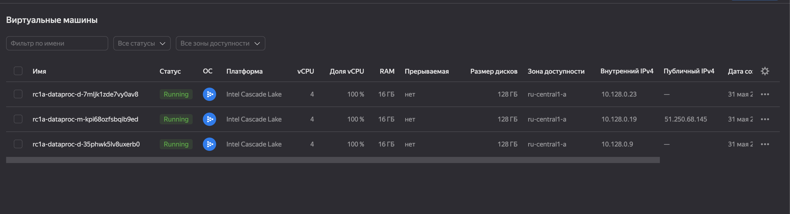
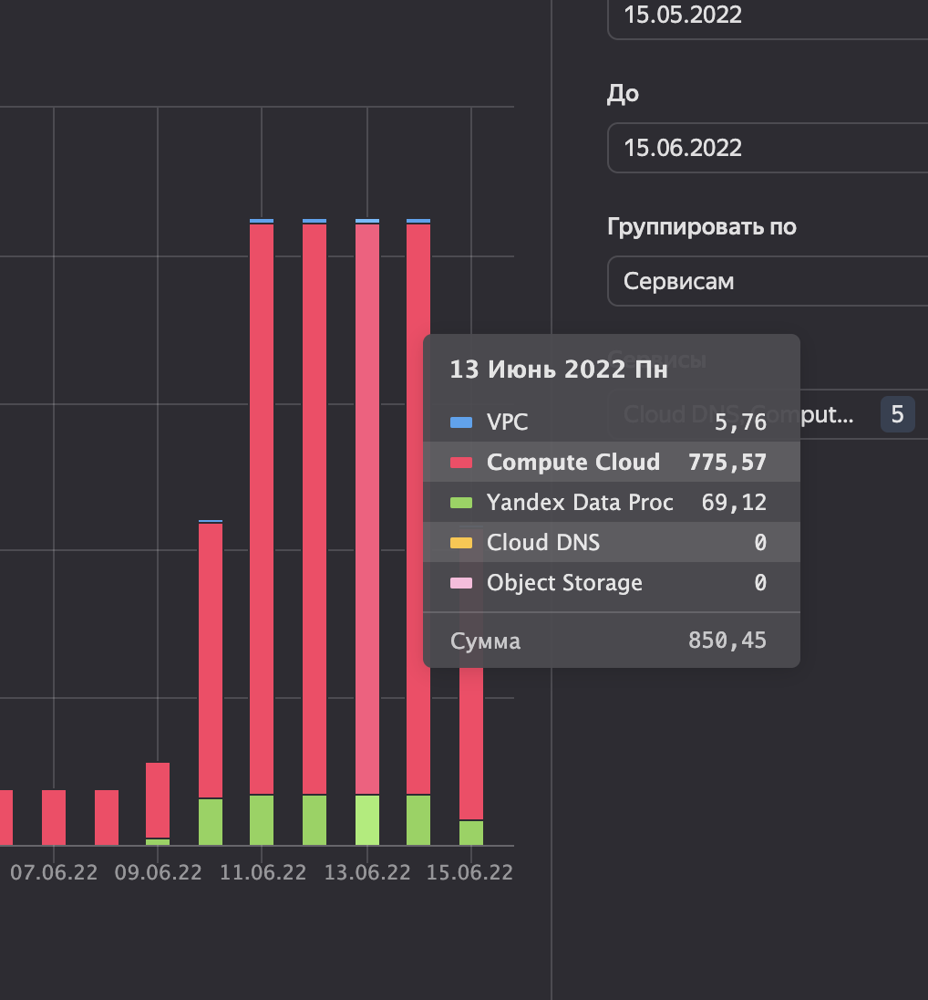
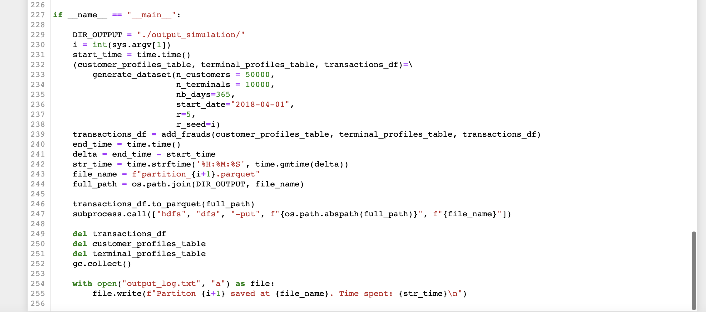
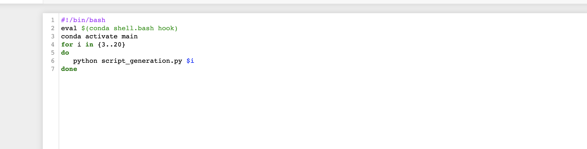
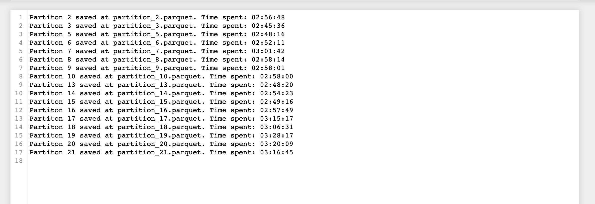

# fraud-detection-ml

# Цели проекта: реализовать Real-Time Banking ML систему, отвечающую всем требованиям по инфраструктуре, работе и качеству предсказаний фрод-транзакций.

Мы имеем следующую структуру работы Fraud-Detection приложения. Необходимо улучшить тот блок, который отвечает за Data Driven Model.

Data Driven Model можно разложить таким образом:

То есть необходимо задизайнить такую систему, которая будет способна отвечать этим требованиям.

# Метрики проекта: Precision (на класс FRAUD) и Recall (на класс FRAUD)

Precision (на класс FRAUD) нам необходимо максимизировать так как в мануале есть следующая информация: "Therefore, the primary goal of a DDM is to return precise alerts, as investigators might ignore further alerts when too many false alarms are reported". То есть мы хотим посылать как можно меньше ложных репортов, иначе на них уже могут перестать обращать внимание.

Recall (на класс FRAUD) нам необходимо максимизировать потому как мы сможем определить а насколько хорошо мы отличаем FRAUD от не FRAUD транзакций.

Из этого следует что мы можем ориентироваться на F1 меру между двумя этими метриками.

Так же можно смотреть на ROC-AUC, так как для подсчета Precision и Recall требуется трешхолд, который мы заранее не знаем, а ROC-AUC от выбора трешхолда не зависит. Плюс ROC-AUC может помочь выбрать этот трешхолд.

# Задачи по SMART

**Общие задачи**

1. Понять какие данные у нас есть, сколько у нас категориальных и количественных признаков (1 неделя).
2. Изучить то как работает текущий процесс принятия решений, предложить бизнесу свой вариант (1 неделя).
3. Набрать команду разработчиков с продактов, объяснять метрики проекта (1 неделя).

**Задачи по Data Engineering**

1. Настроить Kafka для распределения данных в исторические данные и в поток для обработки в существующей модели (3 недели) (если нужно то поднимать тестовый Hadoop).
2. Настроить Hadoop кластер (HDFS, Spark, YARN, Hive, ZooKeeper) для сохранения данных, добавить совместимость с Kafka (4 недели).
3. Настроить очистку и предобработку данных на уровне, когда они попадают в хранилище HDFS (может на уровне Kafka, может как Spark-Application). (2 недели).

**Задачи по DS/MLops**

1. Настроить Pipeline создания training и validation set по расписанию используя Airflow (1.5 недели). 
2. Настроить единый Pipeline для feature engineering, который будет бейзлайном. Его поведение Data Scientists могут менять локально на ноутбуках и экспериментировать. (2 недели)
3. Настроить Pipeline для обучения модели на training set и затем проверки качества модели на validation set (1.5 недели).
4. Поднять Docker на машине, настроить пути и прочее (1 неделя).
5. Настроить Pipeline для выкладывания модели в production. Она будет в виде Docker-Container, принимающего REST запросы. Контейнер будет делать прогон через Pipeline feautre engineering и затем возвращать итоговые предсказания (3 недели).
6. Настроить Grafana для просмотра состояния сервисов и ключевых метрик проекта (2 недели).
7. Настроить MLFlow для экспериментов Data Scientists (2 недели).

# Настройка Yandex Cloud, генерация fraud транзакций и выгрузка результата в HDFS

**Конфигурация DataProc**

Имеем две датаноды и одну master-node. Для оптимизации можно выделять поменьше оперативной памяти датанодам и повысить это значение для master-node, так как во время генерации случались Out Of memory Exceptions

**Затраты на YC**

Как я сказал, можно уменьшить количества ресурсов для датанод, так как они только хранят информацию на дисках

**Python скрипт для генерации**

Написал следующий python-скрипт для генерации fraud транзакций. Он принимает на вход параметр с номером партиции данных, которую мы хотим сгенерировать и выдает +- 40 млн транзакций

Шелл скрипт, внутри которого запускаются python скрипты (после каждого успешного запуска ресурсы полностью освобождаются). Генерация идет на мастер-ноде.

Файл с результатами генерации, можно посмотреть сколько в среднем занимает генерация по времени (примерно 3 часа)

Результат на HDFS. Фактор репликации 1, значит если какая-то из датанод умрет, то доступа к файлу не будет, поэтому для реальных задачек его стоит ставить 2 или 3.
Так же можно подтюнить размер генерируемого файла, чтобы он умещался в 2 блока (512 MB). Сейчас в среднем там 548 MB, так что мы занимаем по 3 блока на один файл.

# Сбор данных по расписанию

**Генерация данных**

Представим на данный момент, что мы не имеем потока с данными из Kafka, а работаем с тем батчем, который сами и генерируем (код для генерации как из прошлого задания). 
Однако теперь вместо [bash скрипта](./imgs/shell_script.png), где мы делали генерацию в цикле, мы хотим поставить эту генерацию на конвеер и делать ее по [расписанию](./Homework_3/dags/fraud_generation_dag.py). 

**Apache Airflow**

Для это задачи хорошо подходит Airflow -- высокоуровневый бэкэнд поверх Celery, позволяющий запускать параллельные задачки в разных тредах. 

Запускаем AirFlow с помощью докера, так как это гораздо удобнее и что называется, flexible. 

Коннект внутри AirFlow worker с HDFS Namenode осуществляется через протокол HTTP с помощью WebHDFS API, а не через HDFS протокол. Для удобного взаимодействия с Hadoop кластером используем библиотеку hdfs для python3. C помощью переменной окружения HDFS_NAMENODE_URL настраиваем URL для подключения к Namenode, так как консольная утилита hdfs внутри worker работать не будет (поскольку мы внутри изолированного докер контейнера). Узнать HDFS_NAMENODE_URL можно выполнив этот [bash скрипт](./Homework_3/get_namenode_url.sh)

**Результаты**

Я сделал тестовый прогон с `schedule_interval=5 minutes` на dummy-df (код его создания закомментил). Получились следующие результаты:

Как мы выяснили из прошлого задания, генерация занимает +- 3 часа, поэтому взять для реальной генерации `schedule_interval=4 hours` мне кажется OK идеей. Вот пример той же папки `/user/airflow`, в которой находятся реально сгенерированные транзакции (порядка 45 миллионов записей):

------

Как мы видим, owner файлов это dr.who -- зарезервированный пользователь со стороны Hadoop, который работает по HTTP протоколу. Использовать его в продакшене мне кажется не совсем безопасно, так как через него можно попробовать достучаться до кластера "с улицы", а это не есть хорошо (хотя если мы сделаем прокси-сервер, проблема будет решена).

# Конвеер подготовки данных

**Apache Airflow**
!!! При выполнении этого задания в связи с миллионом трудностей по запуску Airflow внутри докера и запуска изнутри Spark-submit'a было принято решение по запуску Airflow удаленно на хост машине.

**Получение данных**

Мы уже имеем скрипт, который делает генерацию данных для нас по [расписанию](./Homework_3/dags/fraud_generation_dag.py). Однако теперь мы хотим применять к получающимся данным базовую очистку и feature engeneering. Для решения этой задачи напишем новый [Dag](./Homework_4/dags/cleaning_dag.py) для Apache Airflow. 

Изначально я хотел добавить функционал HdfsSensor'a для проверки получения нового батча данных (чтобы мы не делали обработку одного и того же батча по несколько раз), однако впоследствии он перестал работать по причинам, известным только Airflow ¯\_(ツ)_/¯. Поэтому я решил от него отказаться и поиграться с настройками интервалов для запусков джобов. 

[Скрипт](./Homework_4/pyspark_cleaning.py), в котором написана вся логика по очистке и feature engineering.

**Результаты**

Airflow hub:

 

 Получаемые партиции в HDFS:

 

# Регулярное переобучение

Как только мы получили очищенные [данные](./Homework_4/dags/cleaning_dag.py) с предыдущего шага, мы хотим реализовать скрипт, который будет производить обучение модели в PySpark, сохраняя артифакты этой модели в Mlflow. MLflow это трекинг система, которая позволяет производить мониторинг моделей, логировать артефакты.
Запуск производится с помощью команды `mlflow server -h 0.0.0.0 -p 5001 --backend-store-uri sqlite:///backend.db --default-artifact-root s3://otus-bigdata-dima-ioksha`. Важно, чтобы были правильно настроены переменные среды в терминале, в котором происходит запуск mlflow, а именно: AWS_ACCESS_KEY_ID, AWS_SECRET_ACCESS_KEY, MLFLOW_S3_ENDPOINT_URL.
Полученный [скрипт](./utils/train_model.py).

**Результаты**

Dag:

MLflow:

# Автоматическая валидация

Приступая к этому заданию, я пересмотрел общий пайплайн работы, поэтому я добавил промежуточное [звено](./Homework_5/dags/model_dag.py) по генерации дополнительных [данных](./utils/combine_data.py). Теперь при поступлении новой порции данных, мы собираем батч из 10 порций до этой, обучаем модель и пайплайн обработки. После того как модель и пайплайн готовы, мы делаем валидацию на новой поступившей порции данных. Если новая обученная модель (на данных с n-1 до n-1 - 10) показывает значимо результат лучший чем текущая модель в Продакшене (подгружаем из MLflow), то мы ее заменяем. Если новая [модель](./utils/validate_model.py) не показывает результат лучше, то мы повторяем весь процесс и ждем новую порцию данных. 

**Результаты**

Dag:

Log:

MLflow:

Как можно заметить, не каждая новая обученная модель лучше предыдущей, поэтому мы не меняем старую на нову

MLflow model registry:

